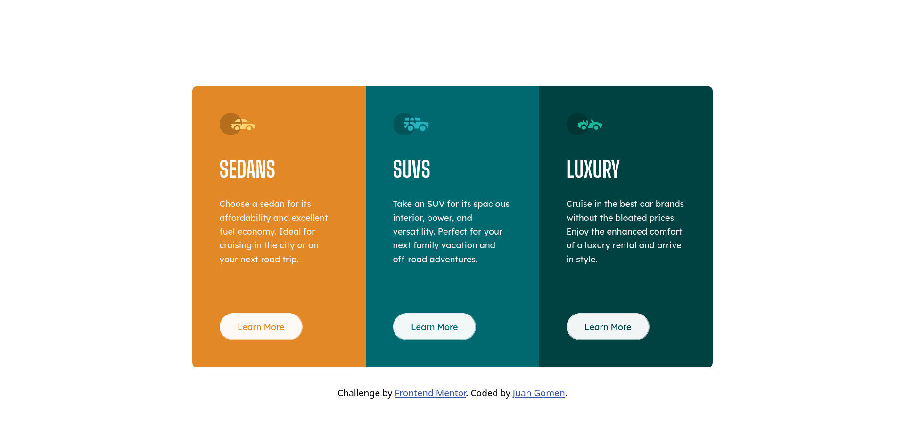

# Frontend Mentor - 3-column preview card component

This is a solution to the [3-column preview card component on Frontend Mentor](https://www.frontendmentor.io/challenges/3column-preview-card-component-pH92eAR2-)
. Frontend Mentor challenges help you improve your coding skills by building realistic projects.

## Table of contents

- [Overview](#overview)
  - [The challenge](#the-challenge)
  - [Screenshot](#screenshot)
  - [Links](#links)
- [My process](#my-process)
  - [Built with](#built-with)
  - [What I learned](#what-i-learned)
- [Author](#author)
- [Acknowledgments](#acknowledgments)

## Overview

### The challenge

Users should be able to:

- View the optimal layout depending on their device's screen size
- See hover states for interactive elements

### Screenshot

### Links

- Solution URL: [3-column preview card component (Vanilla CSS + BEM) | frontendmentor](https://www.frontendmentor.io/solutions/3column-preview-card-component-vanilla-css-bem-Tjrs0PV1FO)
- Live Site URL: [3-column preview card component](https://3-column-preview-card-component-gomen.netlify.app/)

## My process

### Built with

- Semantic HTML5 markup
- CSS custom properties
- Web accessibility
- Flexbox
- CSS Grid

### What I learned

I learnt a lot with this project, I struggled a lot because in my reset.css I
had a rule was breaking everything in the mobile design.

## Author

- Website - [under construction]()
- Frontend Mentor - [@Leviakc](https://www.frontendmentor.io/profile/Leviakc)

## Acknowledgments

I want to acknowledgment [@MelvinAguilar](https://www.frontendmentor.io/profile/MelvinAguilar) because when I was stock I checked his solution and I learnt about the `mix-blend-mode` property and learn a lot from his github so thanks Melvin because I learnt a lot from you.
