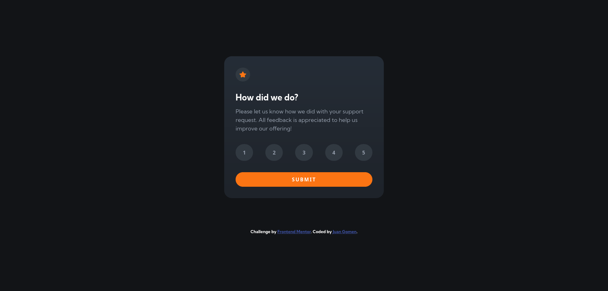

# Frontend Mentor - Interactive rating component solution

This is a solution to the [Interactive rating component challenge on Frontend Mentor](https://www.frontendmentor.io/challenges/interactive-rating-component-koxpeBUmI). Frontend Mentor challenges help you improve your coding skills by building realistic projects.

## Table of contents

- [Overview](#overview)
  - [The challenge](#the-challenge)
  - [Screenshot](#screenshot)
  - [Links](#links)
- [My process](#my-process)
  - [Built with](#built-with)
  - [What I learned](#what-i-learned)
  - [Continued development](#continued-development)
  - [Useful resources](#useful-resources)
- [Author](#author)
- [Acknowledgments](#acknowledgments)

## Overview

### The challenge

Users should be able to:

- View the optimal layout for the app depending on their device's screen size
- See hover states for all interactive elements on the page
- Select and submit a number rating
- See the "Thank you" card state after submitting a rating

### Screenshot

### Links

- Solution URL: [Github solution](https://github.com/Leviakc/frontend-mentor-challenge/tree/main/interactive-rating-component-main)
- Live Site URL: [interactive rating component](https://interactive-rating-component-gomen.netlify.app/)

## My process

### Built with

- Semantic HTML5 markup
- CSS custom properties
- Web accessibility
- Flexbox
- CSS Grid
- [Typescript](https://www.typescriptlang.org/)

### What I learned

I learnt a lot with this project, it was a small project yet it has many things
to practice like event delegation, I did implement a loader and many other
litle things so I'm happy with the result.

### Continued development

I want to keep learning typescript, I want to be as good as [@MattPocock](https://www.youtube.com/@mattpocockuk) so from now on I will only use typescript for every single project.

### Useful resources

- [coolors](https://coolors.co/39434c) - This helped me find colors, sometimes
  it feels like the style-guide.md does not provide the same colors so with
  coolors you can find many colors

- [Using Dataset in JavaScript](https://medium.com/@adamkearney124/using-dataset-in-javascript-5331af3ec6c3) - This help me write less code or have faster code

## Author

- Website - [under construction]()
- Frontend Mentor - [@Leviakc](https://www.frontendmentor.io/profile/Leviakc)
<!--- Twitter - [@yourusername]()-->

## Acknowledgments

I want to acknowledgment my self because I'm keep gettig better and not giving
up with the front end.
