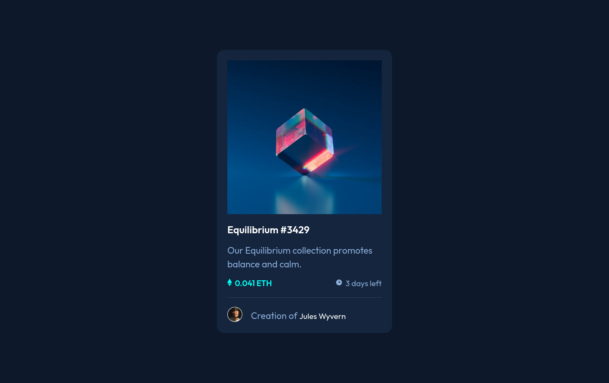

# Frontend Mentor - NFT preview card component solution

This is a solution to the [NFT preview card component challenge on Frontend Mentor](https://www.frontendmentor.io/challenges/nft-preview-card-component-SbdUL_w0U). ## Table of contents

- [Overview](#overview)
  - [The challenge](#the-challenge)
  - [Screenshot](#screenshot)
  - [Links](#links)
- [My process](#my-process)
  - [Built with](#built-with)
- [Author](#author)

## Overview

### The challenge

Users should be able to:

- View the optimal layout depending on their device's screen size
- See hover states for interactive elements

### Screenshot

### Links

- Solution URL: [nft-preview-card-component (vanilla CSS | BEM)](https://www.frontendmentor.io/solutions/nftpreviewcardcomponent-vanilla-css-bem-YssHam6ZR2)
- Live Site URL: [nft-preview-card-component](https://nft-preview-card-component-gomen.netlify.app/)

## My process

### Built with

- Semantic HTML5 markup
- CSS custom properties
- Flexbox
- CSS Grid
- Mobile-first workflow

## Author

- Website - [under construction]()
- Frontend Mentor - [@Leviakc](https://www.frontendmentor.io/profile/Leviakc)

**Note: Delete this note and add/remove/edit lines above based on what links you'd like to share.**
