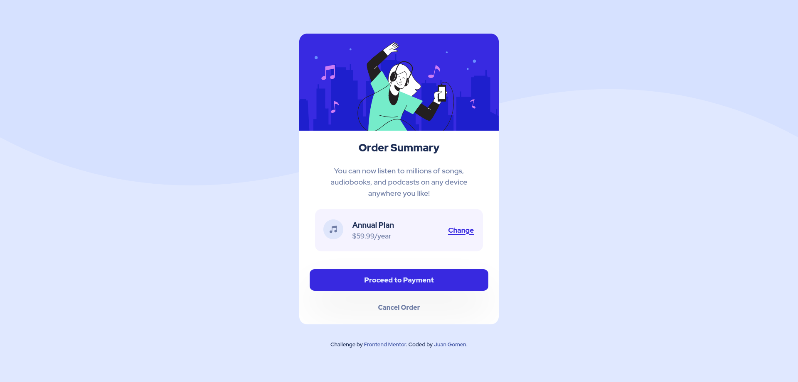

# Frontend Mentor - Product preview card component solution

This is a solution to the [Order summary card challenge on Frontend Mentor](https://www.frontendmentor.io/challenges/order-summary-component-QlPmajDUj). Frontend Mentor challenges help you improve your coding skills by building realistic projects.

## Table of contents

- [Overview](#overview)
  - [The challenge](#the-challenge)
  - [Screenshot](#screenshot)
  - [Links](#links)
- [My process](#my-process)
  - [Built with](#built-with)
  - [What I learned](#what-i-learned)
  - [Continued development](#continued-development)
  - [Useful resources](#useful-resources)
- [Author](#author)

## Overview

### The challenge

Users should be able to:

- View the optimal layout depending on their device's screen size
- See hover and focus states for interactive elements

### Screenshot

### Links

- Solution URL: [Solution](https://github.com/Leviakc/frontend-mentor-challenge/tree/main/order-summary-component-main)
- Live Site URL: [Order component preview](https://order-summary-component-gomen.netlify.app/)

## My process

### Built with

- Semantic HTML5 markup
- CSS custom properties
- Flexbox
- CSS Grid
- Mobile-first workflow

### What I learned

I needed to go back to the basics and refresh my CSS knowledge, specifically
regarding how to position items using flex and grid layouts.

### Continued development

I will keep practice and comparing my result with others so I can learn from
them.

### Useful resources

- [custom-reset.css](https://www.joshwcomeau.com/css/custom-css-reset/) - this
  can help you to have a simple reset in css

## Author

- Website - [under construction]()
- Frontend Mentor - [@Leviakc](https://www.frontendmentor.io/profile/Leviakc)
<!--- Twitter - [@yourusername]()-->
