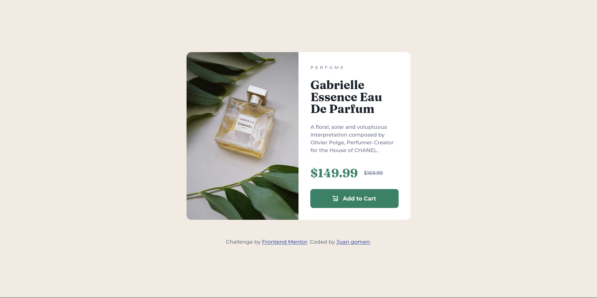

# Frontend Mentor - Product preview card component solution

This is a solution to the [Product preview card component challenge on Frontend Mentor](https://www.frontendmentor.io/challenges/product-preview-card-component-GO7UmttRfa). Frontend Mentor challenges help you improve your coding skills by building realistic projects.

## Table of contents

- [Overview](#overview)
  - [The challenge](#the-challenge)
  - [Screenshot](#screenshot)
  - [Links](#links)
- [My process](#my-process)
  - [Built with](#built-with)
  - [What I learned](#what-i-learned)
  - [Continued development](#continued-development)
  - [Useful resources](#useful-resources)
- [Author](#author)
- [Acknowledgments](#acknowledgments)

## Overview

### The challenge

Users should be able to:

- View the optimal layout depending on their device's screen size
- See hover and focus states for interactive elements

### Screenshot



### Links

- Solution URL: [Solution](https://github.com/Leviakc/frontend-mentor-challenge/tree/main/product-preview-card-component-main)
- Live Site URL: [Product preview card](https://rad-concha-d1471f.netlify.app/)

## My process

### Built with

- Semantic HTML5 markup
- CSS custom properties
- Flexbox
- CSS Grid
- Mobile-first workflow

### What I learned

I didn't know that we could use the source tag for responsive design

```html
<picture class="product__img">
  <source
    srcset="./images/image-product-desktop.jpg"
    media="(min-width: 600px)"
  />
  
</picture>
```

### Continued development

I will keep practice and comparing my result with others so I can learn from
them.

### Useful resources

- [custom-reset.css](https://www.joshwcomeau.com/css/custom-css-reset/) - this
  can help you to have a simple reset in css
- [Inclusively hidden](https://www.scottohara.me/blog/2017/04/14/inclusively-hidden.html) - "The goal should be to craft interfaces and experiences that are accessible and understandable to as many people as possible. Not to create interfaces where we can shoe horn in additional context by visually hiding it by default."

## Author

- Website - [under construction]()
- Frontend Mentor - [@Leviakc](https://www.frontendmentor.io/profile/Leviakc)
<!--- Twitter - [@yourusername]()-->

## Acknowledgments

Thanks [Kevin Powell](https://www.youtube.com/@KevinPowell) to teach me a lot
and the best part for free, this knowledge is pure gold
