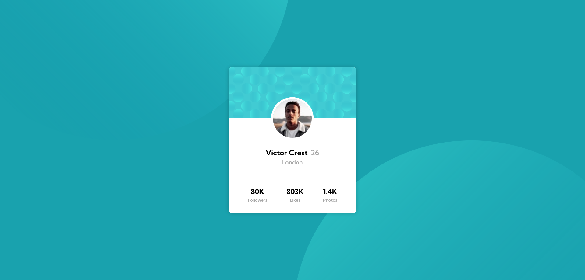

# Frontend Mentor - 3-column preview card component

This is a solution to the [Profile card component on Frontend Mentor](https://www.frontendmentor.io/challenges/profile-card-component-cfArpWshJ)
. Frontend Mentor challenges help you improve your coding skills by building realistic projects.

## Table of contents

- [Overview](#overview)
  - [The challenge](#the-challenge)
  - [Screenshot](#screenshot)
  - [Links](#links)
- [My process](#my-process)
  - [Built with](#built-with)
  - [What I learned](#what-i-learned)
- [Author](#author)

## Overview

### The challenge

Users should be able to:

- View the optimal layout depending on their device's screen size

### Screenshot

### Links

- Solution URL: [Profile card component (Vanilla CSS + BEM) | frontendmentor](https://www.frontendmentor.io/solutions/profile-card-component-vanilla-css-bem-frontendmentor-uYUwihCYkz)
- Live Site URL: [Profile card component](https://profile-card-component-gomen.netlify.app/)

## My process

### Built with

- Semantic HTML5 markup
- CSS custom properties
- Web accessibility
- Flexbox
- CSS Grid

### What I learned

I learnt a lot with this project, I struggled in this challenge because I was
not able to acomplish what I wanted

## Author

- Website - [under construction]()
- Frontend Mentor - [@Leviakc](https://www.frontendmentor.io/profile/Leviakc)
