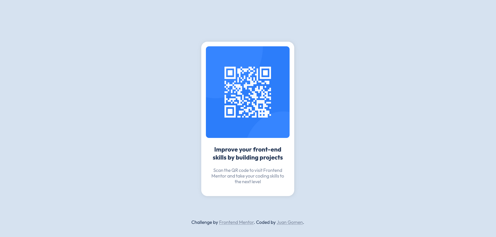

# Frontend Mentor - QR code component solution

This is a solution to the [QR code component challenge on Frontend
Mentor](https://www.frontendmentor.io/challenges/qr-code-component-iux_sIO_H).
Frontend Mentor challenges help you improve your coding skills by building
realistic projects.

## Table of contents

- [Overview](#overview)
  - [Screenshot](#screenshot)
  - [Links](#links)
- [My process](#my-process)
  - [Built with](#built-with)
  - [What I learned](#what-i-learned)
  - [Continued development](#continued-development)
  - [Useful resources](#useful-resources)
- [Author](#author)
- [Acknowledgments](#acknowledgments)

## Overview

### Screenshot



### Links

- Solution URL: [Repository](https://github.com/Leviakc/frontend-mentor-challenge/tree/main/qr-code-component-main)
- Live Site URL: [Qr code component](https://superb-manatee-3f2e79.netlify.app/)

## My process

### Built with

- Semantic HTML5 markup
- Flexbox
- CSS Grid

### What I learned

I learnt that the 62.5% trick can attract compatibility issues with third-party
libraries or plugins

```css
html {
  /* 10px / 16px = 0.625 = 62.5% */
  font-size: 62.5%;
  overflow-x: hidden;
}
```

### Continued development

I will keep improving in how to use the proper units or at least not having
compatibility issues with some third-party libraries

### Useful resources

- [The Surprising Truth About Pixels and Accessibility - The 62.5%
  trick.](https://www.joshwcomeau.com/css/surprising-truth-about-pixels-and-accessibility/#the-sixtwofive-trick-13)
  - This helped me to realized that some tricks maybe useful but also can lead
    to a bad practice

## Author

- Frontend Mentor -
  [@Leviakc](https://www.frontendmentor.io/profile/Leviakc)
- Github - [Leviakc](https://github.com/Leviakc)
- Website - [under construction]()

## Acknowledgments

My very thanks to [@MelvinAguilar](https://www.frontendmentor.io/profile/MelvinAguilar), thanks for letting me know about the 62.5% trick.
